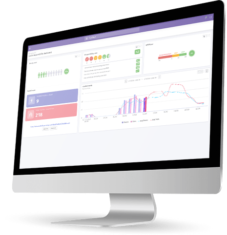
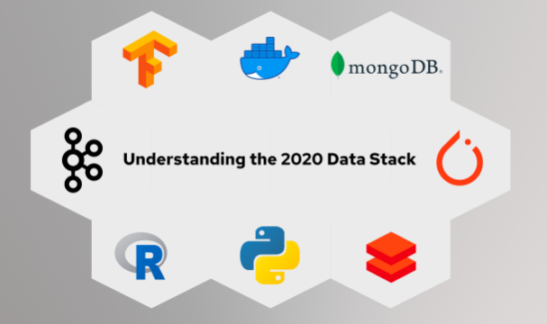
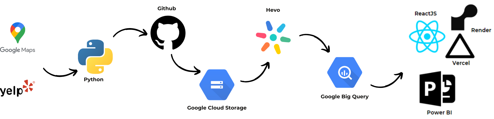
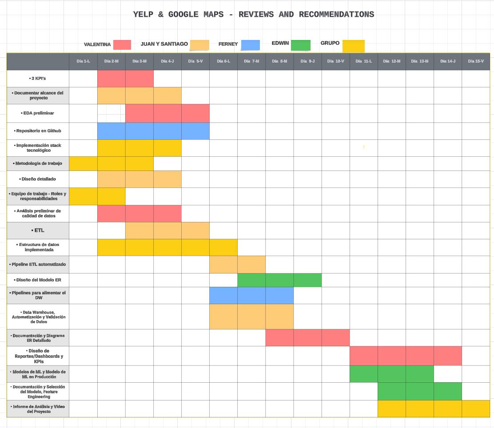
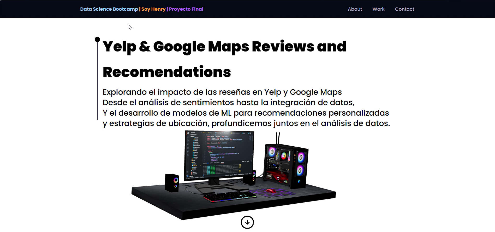

<h1 align="center">PROYECTO GRUPAL</h1>

<h2 align="center">YELP & GOOGLE MAPS - REVIEWS AND RECOMMENDATIONS</h1>

## **Contexto**

La opinión de los usuarios es un dato muy valioso, que crece día a día gracias a plataformas de reseñas. Su análisis puede ser determinante para la planificación de estratenias. Yelp es una plataforma de reseñas de todo tipo de negocios, restaurantes, hoteles, servicios entre otros. Los usuarios utilizan el servicio y luego suben su reseña según la experiencia que han recibido. Esta información es muy valiosa para las empresas, ya que les sirve para enterarse de la imagen que tienen los usuarios de los distintos locales de la empresa, siendo útil para medir el desempeño, utilidad del local, además de saber en qué aspectos hay que mejorar el servicio. Además, Google posee una plataforma de reseñas de todo tipo de negocios, restaurantes, hoteles, servicios, entre otros integrada en su servicio de localización y mapas, Google Maps. Los usuarios utilizan el servicio y luego suben su reseña según la experiencia vivida. Muchos usuarios leen las reseñas de los lugares a los que planean ir para tomar decisiones sobre dónde comprar, comer, dormir, reunirse, etc. Esta información es muy valiosa para las empresas, ya que les sirve para enterarse de la imagen que tienen los usuarios de los distintos locales de la empresa, siendo muy útil para medir el desempeño, utilidad del local, además de identificar los aspectos del servicio a mejorar.

## **Datasets y fuentes complementarias**

"Los datos son extraídos de la plataforma de reseñas Yelp y de Google Maps, para Estados Unidos. Tiene información sobre la ubicación de los comercios, su categoría, puntajes promedios, si están abiertos o no, sobre los usuarios, las reseñas que hicieron, cuántas reseñas hicieron, cuántos votos han recibido esas reseñas entre otros. Se puede complementar el análisis con datasets adicionales que ofrezcan información que consideren pertinente al pedido (valores de acciones de las empresas, información geográfica adicional de los locales, etc). Recomendamos fuertemente el uso de NLP para procesar la información de las reseñas."

### **Fuentes de datos**

+   [Diccionario de Datos](https://docs.google.com/document/d/1ASLMGAgrviicATaP1UJlflpmBCXtuSTHQGWdQMN6_2I/edit)
Fuentes de datos obligatorias:
+   [Dataset de Google Maps](https://drive.google.com/drive/folders/1Wf7YkxA0aHI3GpoHc9Nh8_scf5BbD4DA?usp=share_link)
+   [Dataset de Yelp!](https://drive.google.com/drive/folders/1TI-SsMnZsNP6t930olEEWbBQdo_yuIZF?usp=sharing)

# <u>Data Banks</u>

## Obtén la mejor información sobre bancos y clientes en Estados Unidos.

## ¿Quienes Somos?
Somos una consultora en ciencia de datos que busca ser reconocida por su  seguridad y distinción.

### Data Engineer: 
 - Juan Bautista Sosa Lizarraga
 - Santiago Moresi

### Data Analytics:
 - Valentina Padilla Ballesteros

### Data Science:
 - Edwin Vázquez Mori

### DevOps:
 - Ferney Andrés Castaño Estrada

## Entendimiento de las necesidades
- Realizar un análisis del mercado estadounidense.
- Análisis detallado de la opinión de los usuarios en Yelp y cruzarlos con los de Google Maps sobre bancos y otros negocios afines al turismo y ocio, utilizando análisis de sentimientos, predecir tendencias.
- Saber dónde es conveniente emplazar las nuevas franquicias y afines.
- Tener un sistema de recomendación servicios financieros para los clientes del banco.
- Creación de una base de datos (DataWarehouse)

## Objetivo principal
 - Desarrollar modelo de machine Learning para obtener nuevas ubicaciones de Franquicias y mejor atención al cliente.

### Objetivos específicos:

 - Realizar un análisis de series temporales para comprender la evolución de las reseñas bancarias a lo largo del tiempo.
 - Evaluar la satisfacción general de los usuarios con los locales que ofrecen servicios bancarios.
 - Utilizar técnicas de procesamiento de lenguaje natural (NLP) para entender el sentimiento en las reseñas bancarias.
 - Ponderar el valor de sentimiento por la puntuación de la reseña.
 - Utilizar gráficos para representar la tendencia del sentimiento promedio a lo largo del tiempo.

### Alcance:

 - Desarrollar un modelo de machine learning con datos de Google Yelp, específicamente de la categoría de bancos para prever y aumentar las ventas en el sector bancario.

## Análisis exploratoria de datos (EDA) YELP

### Introducción:
En el corazón de la vasta información contenida en el conjunto de datos de Yelp, hemos realizado un exhaustivo Análisis Exploratorio de Datos (EDA) para revelar las dinámicas clave que definen la plataforma. A través de este viaje, hemos explorado la actividad de usuarios, la distribución de reseñas, y la presencia de negocios en diversas ciudades. Este análisis no solo arroja luz sobre los patrones emergentes, sino que también destaca las relaciones sociales entre los usuarios y las tendencias temporales que han evolucionado a lo largo de los años.

### Conclusiones: 
A través de estos objetivos, hemos desglosado el vasto conjunto de datos de Yelp para comprender mejor la interacción de los usuarios, las preferencias y las dinámicas subyacentes que definen la experiencia en la plataforma. Este análisis no solo proporciona insights valiosos, sino que también sienta las bases para futuras investigaciones y mejoras en la plataforma Yelp.

## Análisis Exploratorio de Datos (EDA) - Google Maps

### Introducción:
Este análisis exploratorio de datos se enfoca en el conjunto de datos de Google Maps, centrándose en archivos Parquet relacionados con bancos, metadata y reseñas. El objetivo principal es proporcionar una comprensión detallada de la información contenida en estos archivos.

### Conclusión:
Este análisis exploratorio proporciona una visión completa de los datos de Google Maps, revelando patrones interesantes y tendencias en la información recopilada. Estos resultados son fundamentales para la toma de decisiones informadas y futuros análisis en el ámbito geoespacial y de reseñas de bancos.
    
## KPI's con sus objetivos asociados

### KPI: Tendencia de Opiniones Bancarias
#### Objetivo: Realizar un análisis de series temporales para comprender la evolución de las reseñas bancarias a lo largo del tiempo.

#### Método:
 - Agrupar las reseñas por mes o trimestre.
 - Utilizar gráficos de líneas o barras para visualizar las tendencias.

#### Resultados Esperados:
 - Identificar patrones estacionales o cambios significativos en la cantidad de reseñas relacionadas con Bancos.
 - Proporcionar una visión temporal de la percepción de los usuarios hacia los servicios bancarios.

### KPI: Puntuación Promedio de Locales Bancarios
#### Objetivo: Evaluar la satisfacción general de los usuarios con los locales que ofrecen servicios bancarios.

#### Método:
 - Extraer la información de puntuación de los locales bancarios.
 - Calcular el promedio de las puntuaciones obtenidas.

#### Resultados Esperados:
 - Obtener una métrica cuantitativa de la satisfacción de los usuarios con los servicios bancarios.
 - Identificar locales con puntuaciones notables, ya sean positivas o negativas.

### KPI: Sentimiento Promedio de Reseñas Bancarias

#### Análisis de Sentimientos
##### Objetivo:
- Utilizar técnicas de procesamiento de lenguaje natural (NLP) para entender el sentimiento en las reseñas bancarias.

##### Método:
 - Asignar un valor numérico a cada reseña para representar el sentimiento expresado por el usuario.

##### Resultados Esperados:
 - Obtener una comprensión cuantitativa de la actitud de los usuarios hacia los servicios bancarios.

#### Ponderación por Puntuación de Reseña

##### Objetivo:
Considerar la puntuación numérica asociada con cada reseña para ajustar el valor de sentimiento.

##### Método:
 - Ponderar el valor de sentimiento por la puntuación de la reseña.

##### Resultados Esperados:
 - Dar mayor peso a las reseñas con puntuaciones extremas para reflejar su impacto en el sentimiento general.

#### Cálculo del Sentimiento Promedio
##### Objetivo:
- Calcular una métrica compuesta que represente el sentimiento promedio de todas las reseñas bancarias.

##### Método:
 - Sumar los valores de sentimiento ponderados y dividir por el número total de reseñas.

##### Resultados Esperados:
 - Obtener una métrica cuantitativa del sentimiento general de los usuarios hacia los servicios bancarios.

### Visualización y Monitoreo:

#### Objetivo:
- Utilizar gráficos para representar la tendencia del sentimiento promedio a lo largo del tiempo.

#### Resultados Esperados:
 - Proporcionar una herramienta visual para monitorear cambios en la percepción de los usuarios.
 - Facilitar la identificación de áreas de mejora y evaluar el impacto de cambios implementados.

#### Conclusión KPI's:
 - Los KPIs proporcionan una visión holística de la percepción de los usuarios hacia los servicios bancarios en plataformas como Yelp y Google Maps.
 - La combinación de tendencias temporales, puntuaciones promedio y análisis de sentimientos ofrece una evaluación completa y cuantitativa.
 - Estos KPIs permitirán a la institución bancaria identificar áreas de oportunidad y tomar decisiones informadas para mejorar la experiencia del usuario.

## Solución del Problema

### Solución 1: Sistema de machine learning para la ubicación de nuevas sucursales bancarias

- Definición del problema: La falta de información precisa sobre la ubicación óptima para nuevas sucursales bancarias.

- Causa: Falta de análisis detallado de datos geoespaciales y demográficos para identificar áreas con alta demanda y potencial de crecimiento.

- Efecto: Apertura de sucursales en ubicaciones sub-óptimas, lo que resulta en menor tráfico de clientes, menor rentabilidad y posiblemente cierre de sucursales no rentables.
- Solución del problema: Sistema de machine learning para la ubicación de nuevas sucursales bancarias.

### Solución 2: Sistema de recomendación de servicios financieros para clientes bancarios

 - Definición del problema: Ausencia de personalización en la oferta de servicios financieros a los clientes.

- Causa: Falta de un sistema que analice de manera efectiva la información del cliente para proporcionar recomendaciones personalizadas.

- Efecto: Oferta de servicios financieros genéricos que no satisfacen las necesidades específicas del cliente, resultando en menor satisfacción del cliente y pérdida de oportunidades de venta cruzada.

- Solución del problema: Sistema de recomendación de servicios financieros para clientes bancarios.

## Implementación del Stack Tecnológico

### Proceso ETL y Limpieza de Datos:
- Python (Pandas, NumPy) para manipulación y limpieza de datos.
- Apache Spark para procesamiento distribuido si el conjunto de datos es muy grande.

### Análisis Exploratorio de Datos (EDA):
- Python (Pandas, Matplotlib, Seaborn) para visualización de datos.
- Jupyter Notebooks para el desarrollo interactivo.

### Arquitectura del Proyecto:
- Flask o FastAPI para construir una API REST si es necesario.
- My SQL para interactuar con bases de datos relacionales si es necesario almacenar datos procesados.
- Docker para contenerizar la aplicación y sus dependencias.
- Github para el control de versiones.
- Github Actions para la carga de los datos.
- Google Cloud Storage para el almacenamiento en la nube.
- Hevo para la automatización del pipeline.
- Google Big Query para la baste de datos.

### Machine Learning y Modelado:
- Scikit-Learn para algoritmos de aprendizaje automático.
- TensorFlow o PyTorch para modelado y entrenamiento de redes neuronales si es necesario.
- XGBoost, LightGBM para modelos de árboles si es necesario.
- Pipenv o Conda para manejar entornos virtuales y dependencias.
- NLTK y spaCy, para facilitar el procesamiento y análisis de texto.

### Presentación de Resultados e implementación final
- Power Bi para crear dashboard interactivos.
- ReactJS para desarrollar la pagina web
- Vercel para desplegar la pagina web
- Render para desplegar la API
- Github Actions para CI/CD

### Colaboración y Documentación:
 - Visual Studio Live.
 - Github.

## Workflow

Se realiza una normalización inicial utilizando el código en las notebook de ETL de [Google](Notebooks/ETL_Google.ipynb) y [Yelp](Notebooks/ETL_Yelp.ipynb). Una vez realizadas las transformaciones, se guardan los archivos limpios en formato CSV en la carpeta [Cloud Upload](data/Cloud_Upload) e inicia el proceso automatizado del pipeline.

1. Al realizar un commit, mediante [Github Actions](.github/workflows/upload.yml), se cargan los datos de la carpeta [Cloud Upload](data/Cloud_Upload) aun bucket en Google Cloud Storage (GCS).
2. Una vez en GCS, la plataforma de canalización de datos sin mantenimiento Hevo sincroniza automáticamente los datos con el almacén.
3. Una vez se cargan los datos a Google Big Query, se realizan mediante queries automatizadas las transformaciones relacionales necesarias, y se realiza la validación de datos.

* Se puede observar un ejemplo del funcionamiento del pipeline en el siguiente [video](https://drive.google.com/file/d/1HyJRpT46ceQ2OCCmp97xGefMT0lWdl5y/view?usp=drive_link).
## Diagrama de Gannt

## Metodología de Trabajo
Estamos siguiendo la metodología Scrum, utlizando 3 Sprints:

- **Sprint 1:** Planificación del proyecto y reunión con Product Owner.
- **Sprint 2:** Data Analytics y Data Science.
- **Sprint 3:** Implementación y reunión Final con Product Owner.

## Brief del producto

### Tipo de producto entregado
- Desarrollaremos una app web tomando en cuenta que su creación es más sencilla y económica y no necesitaremos permisos externos para publicarla en las tiendas de aplicaciones.
- Dashboard interactivo para el análisis visual de los datos.
- Repositorio Github con indicaciones del proyecto.

### Productos/servicios
Por el momento, el plan es el desarrollo y lanzamiento del sistema de ubicación de nuevas sucursales y el sistema de recomendación para los clientes del banco que se describió anteriormente.

### Arquitectura Web

- Contexto del proyecto
- Flujo de trabajo
- Stack tecnologico
- Implementaciones en vivo para los sistemas de ubicación y recomendación
- Team members
- Contacto

## Roles y responsabilidades

### Data Engineer

#### Responsabilidades:
- Desarrollo del ETL: Encargarse de diseñar, implementar y mantener el proceso de Extracción, Transformación y Carga (ETL) de datos.
- Gestión de la Estructura de Datos: Implementar y administrar la estructura de datos, como Data Warehouse (DW) o Data Lake (DL), según las necesidades del proyecto.
- Automatización de Pipelines: Desarrollar y mantener pipelines automatizados para garantizar la recopilación y transformación continua de datos.
- Validación de Datos: Implementar procesos de validación para garantizar la integridad y calidad de los datos almacenados.
- Documentación del Proceso: Crear documentación detallada sobre el proceso ETL, la arquitectura y los flujos de datos para facilitar la comprensión y mantenimiento.
- Diseño del Modelo Entidad-Relación (ER): Encargarse del diseño detallado del modelo ER, incluyendo tablas, claves primarias (PK), claves foráneas (FK) y tipos de datos.
- Gestión del Data Warehouse: Implementar y administrar el Data Warehouse, asegurando un rendimiento eficiente y escalabilidad.
- Diseño y Mantenimiento de Pipelines para Alimentar el DW: Desarrollar pipelines para alimentar de manera continua el Data Warehouse con datos actualizados y relevantes.
- Gestión del Diccionario de Datos: Crear y mantener un diccionario de datos que describa cada elemento presente en la base de datos.

### Data Analytics

#### Responsabilidades:
- Realizar análisis exploratorio de datos (EDA)
- Desarrollar estudio de mercado Estadounidense.
- Reporte y análisis: Redactar Reporte Final. Presentación de resultados Dashboard.
- Realizar análisis de la competencia: Recopilación de información sobre los competidores.
- Análizar tendencias: Recopilación de información sobre las tendencias del mercado.
Análisis de su impacto en el negocio del cliente. Identificación de oportunidades de diferenciación.
- Realizar recomendaciones: Formulación de recomendaciones basadas en el análisis.Proposición de estrategias para mejorar la posición del cliente en el mercado.

### Data Scientist

#### Responsabilidades:

- Supervisar y liderar todo el proyecto.
- Definir preguntas clave y objetivos.
- Contribuir al análisis exploratorio y modelado predictivo.
- Coordinar con otros miembros del equipo.
- Desarrollar Modelos Predictivos: Crear modelos de machine learning para predecir la ubicación de nuevas franquicias bancareas. Tendencias de crecimiento o decrecimiento de negocios basados en las opiniones de los usuarios.
- Desarrollar Sistemas de Recomendación: Diseñar y desarrollar sistemas de recomendación para los usuarios de la plataforma.
- Desarrollar NLP: Evaluar las reseñas de usuarios mediante técnicas de análisis de sentimientos para comprender la actitud expresada hacia los negocios.

### DevOps

#### Responsabilidades:
- Asegurar el despliegue eficiente de la aplicación web y la API.
- Gestionar la infraestructura en la nube que soporta tanto la interfaz web como el modelo de machine learning.
- Asegurar la seguridad y la escalabilidad de la aplicación y la API.
- Colaborar estrechamente con desarrolladores, científicos de datos y analistas para entender los requisitos y necesidades de despliegue.
- Desplegar y mantener una interfaz web desarrollada en React que consuma una API de un modelo de machine learning.
- Asegurar la alta disponibilidad, seguridad y escalabilidad de la aplicación y la API.
- Implementar prácticas de CI/CD para automatizar el proceso de despliegue y actualizaciones.
